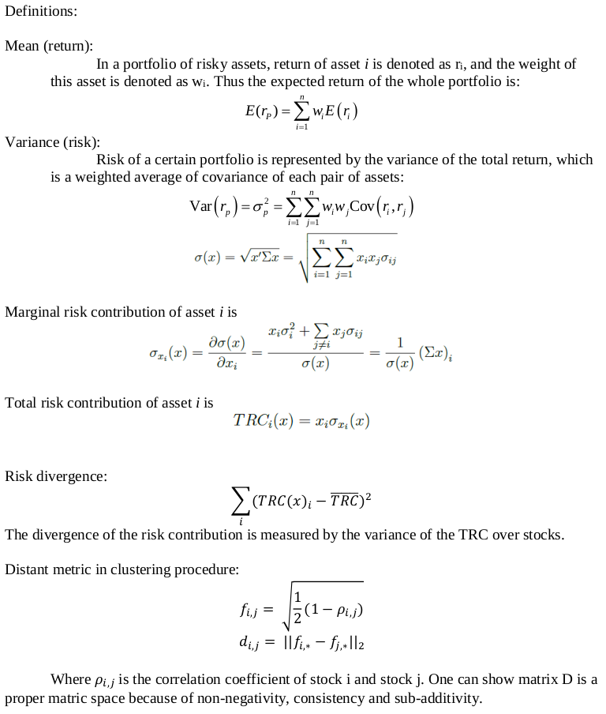
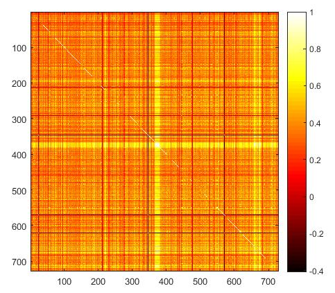
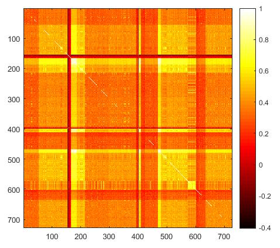
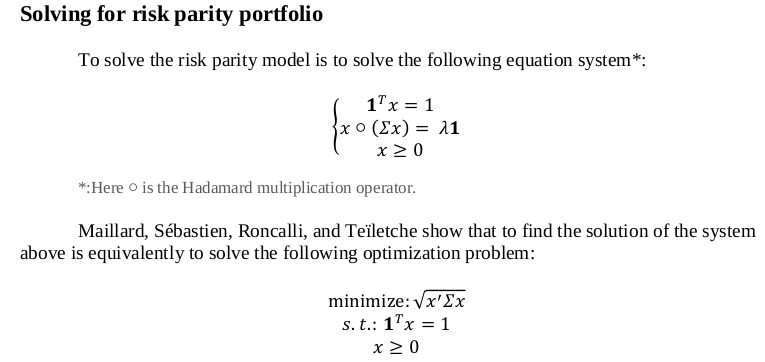
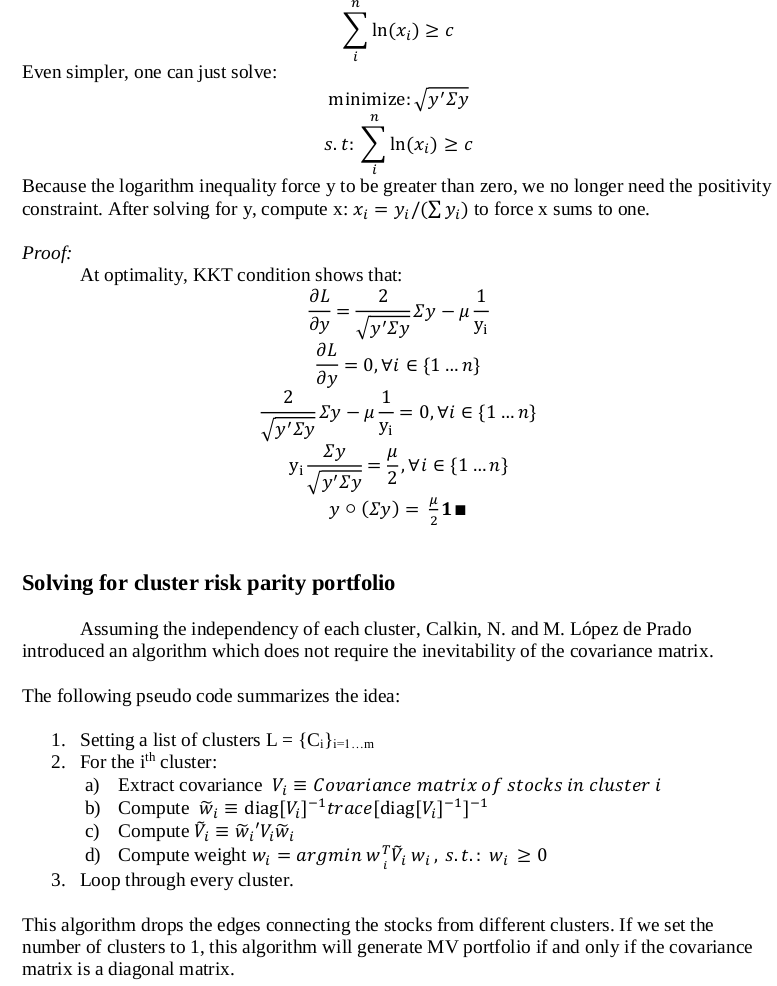

# PCA_Clustering_Parity_Portfolio

### Methodology

### Clustering Procedure

We use K-means clustering. The initial centers of the clusters are generated utilizing PCA analysis. Our algorithm runs a principal component decomposition and extract the first Eigen vector. Then, for every stock, compute the variance of features projected on the first principal component. At last, pick the stocks such that the features of these stocks vary the most on the principal component vector.

In our study, we pick 30 cluster centers to begin. In fact, one can incorporate his or her own understanding of the structure of stock market in to this procedure. For example, we force the model to assign certain stocks into the same cluster (like AAPL and GOOG) by penalizing the violation of such constraints. Since to solve the K-means model is to alternatively solving two quadratic problems, we can easily mix it with other constraints.

On the other hand, investors can choose the level of risk concentration by altering the number of clusters. Intuitively, if one puts all the stocks in only one cluster, the CRP should converge to the MV portfolio; if one sets the number of clusters to the number of stocks, CRP should converge to RP. In fact, in the next section, we will see back testing results confirm this guess. This property of CRP allows investors to adjust their own strategies incorporating their information. 

Figure is the heat map of the correlation matrix before clustering. After clustering, we sort the stocks so that stocks from the same clusters are placed together while stocks from different clusters are placed far apart. The correlation matrix estimated from the sorted price data is shown in Figure 5. We can see that there are block-like structures in the correlation matrix which implies that models using the whole covariance matrix might fail to capture the nature of the risk.

### Solving for risk parity portfolio

